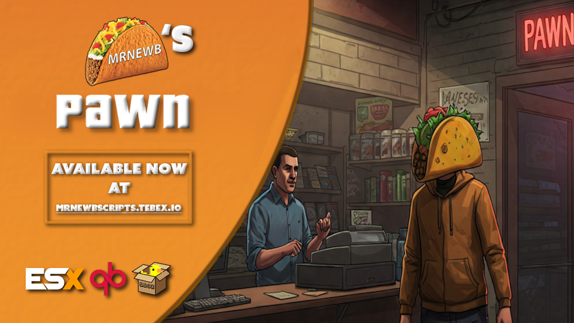

# MrNewbPawn

Pawn shops with optional buy-back of sold stock, plus foundry box zones for smelting.

[Documentation](https://mrnewb.github.io/docs/mrnewbpawn) · [Install guide](https://mrnewb.github.io/docs/mrnewbpawn/install) · [Tebex](https://mrnewbscripts.tebex.io/) · [Discord](https://discord.gg/mrnewbscripts) · [Preview](https://www.youtube.com/watch?v=T4BHIxLF6F8)

[](https://www.youtube.com/watch?v=T4BHIxLF6F8)



## Features

- Ped pawn shops with sell lists
- Optional buy-back of items other players sold (`PurchaseStock` / `PurchaseMarkup`)
- Optional in-game store hours
- Foundry box zones with melt recipes
- Sold stock is in-memory per shop until restart
- Items are **not** usable — shops and foundries are the only path

## Install

Needs [ox_lib](https://github.com/overextended/ox_lib) and [Newb_Bridge](https://github.com/MrNewb/Newb_Bridge). Item paste and PNGs: [install guide](https://mrnewb.github.io/docs/mrnewbpawn/install).

```cfg
ensure ox_lib
ensure Newb_Bridge
ensure MrNewbPawn
```

Copy `[INSTALL]/images/` into your inventory images folder. Do not add `server.export`.

## Config

`configs/config.lua` — shop locations, sell lists, hours, `PurchaseStock` / `PurchaseMarkup`, foundry boxes, melt recipes.

[Item setup](https://mrnewb.github.io/docs/mrnewbpawn/install/inventory) · [Item images](https://mrnewb.github.io/docs/mrnewbpawn/install/inventory-images).
